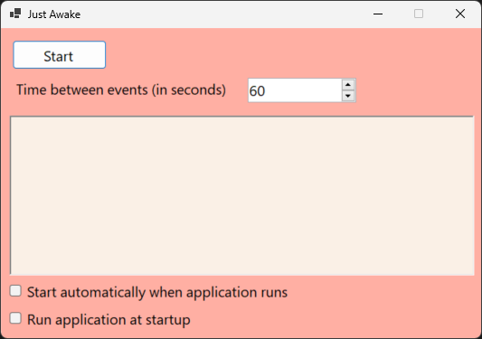
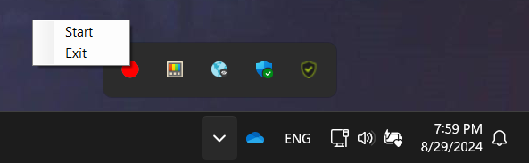

Just awake
==========

Keep Windows awake for as long as you want

Just press *Start*. The application will start to send input events periodically, that will make it seem like you are moving the mouse.

* Check <em>Start automatically when application runs</em> if you want the application to start sending events in the background automatically.
* Check <em>Run application at startup</em> if you want the application to run when you start your computer.

> Closing the window will only hide the app!

To close the application go to System Tray, Right Click on the icon and click <em>Exit</em>.

